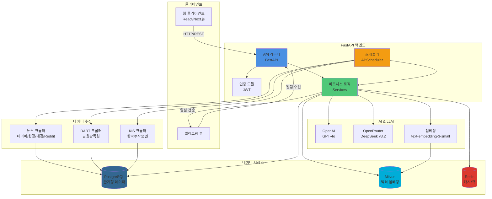
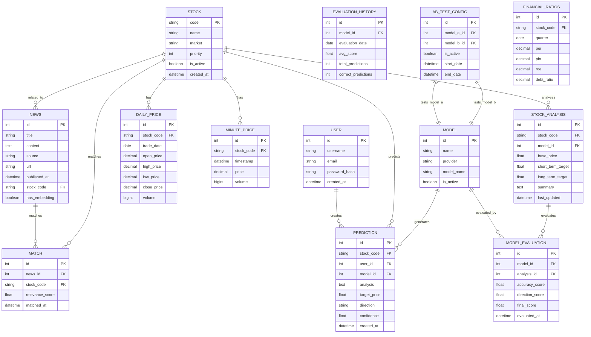
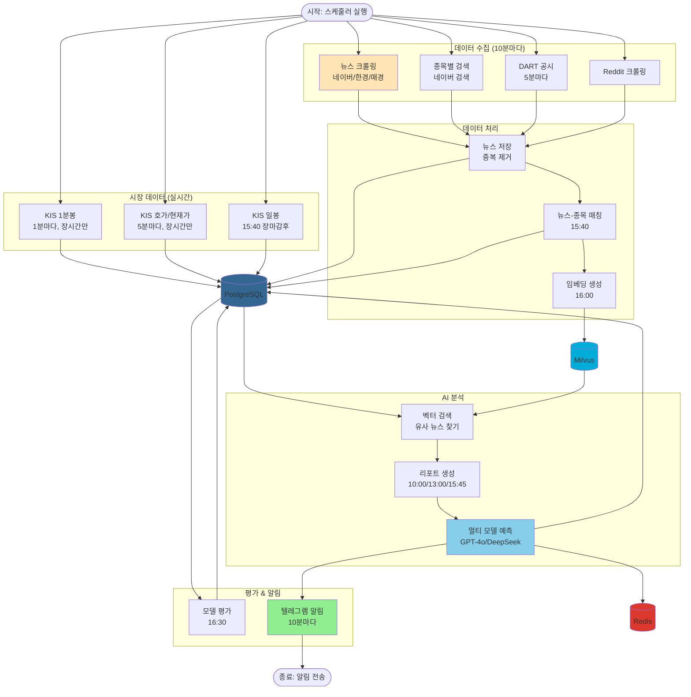
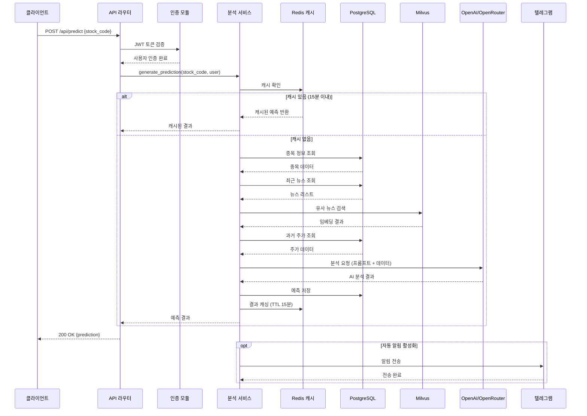
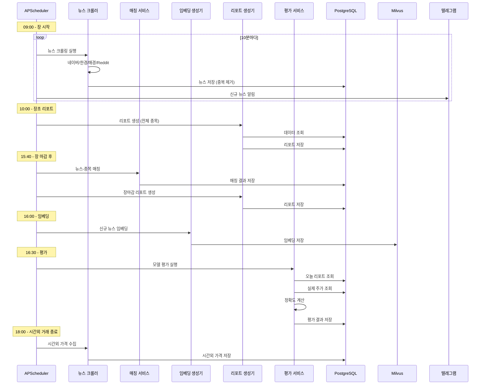

# 백엔드 아키텍처 (FastAPI 서비스)

## 개요

AI 기반 주식 인사이트를 제공하는 FastAPI 기반 API 및 스케줄러 서비스입니다. PostgreSQL로 관계형 데이터를 관리하고, Milvus로 임베딩을 저장하며, Redis로 캐싱을 처리하고, APScheduler로 비동기 작업을 스케줄링합니다.

## 기술 스택

### 핵심 프레임워크
- **Python 3.11**: 프로그래밍 언어
- **FastAPI 0.104.1**: 웹 API 프레임워크
- **Uvicorn 0.24.0**: ASGI 서버

### 데이터베이스 & 스토리지
- **PostgreSQL**: 주 데이터베이스 (SQLAlchemy 2.0.23 ORM)
- **Milvus 2.3.4**: 벡터 임베딩 저장소
- **Redis 5.0.1**: 캐싱 및 작업 큐

### 스케줄링 & 비동기
- **APScheduler 3.10.4**: 백그라운드 작업 스케줄러 (실제 사용)
- ~~Celery~~ (requirements.txt에 있지만 사용하지 않음)

### AI & LLM
- **OpenAI 2.7.2**: GPT-4o (예측), text-embedding-3-small (임베딩)
- **OpenRouter**: DeepSeek v3.2 (대체 LLM 제공자)
- **A/B Testing**: 멀티 모델 성능 비교

### 데이터 수집
- **BeautifulSoup4 4.12.2**: HTML 파싱
- **Requests 2.31.0**: HTTP 클라이언트
- **PRAW 7.8.1**: Reddit API 클라이언트
- **KIS OpenAPI**: 한국투자증권 실시간 시장 데이터

### 인증 & 보안
- **python-jose 3.3.0**: JWT 토큰 관리
- **passlib 1.7.4 + bcrypt 3.2.2**: 비밀번호 해싱

## 아키텍처 패턴

**서비스 지향 아키텍처 (SOA)**

```
FastAPI App
├── API Routers (/backend/api/)
│   ├── 공통 의존성 (config.py)
│   └── 서비스/리포지토리 레이어 호출
├── Background Scheduler (APScheduler)
│   ├── 크롤러 작업 (뉴스, 주가)
│   ├── 예측 배치 작업
│   └── 평가 작업
└── 비동기 작업 큐 (선택적)
```

### 시스템 아키텍처 다이어그램



## 데이터 아키텍처

### 관계형 데이터 (PostgreSQL)

`docs/data-models-backend.md`에 문서화된 엔티티들:
- **사용자**: `user` (인증 정보)
- **종목**: `stock` (종목 정보, 우선순위)
- **뉴스**: `news` (크롤링된 뉴스 기사)
- **예측**: `prediction`, `stock_analysis` (AI 예측 결과)
- **평가**: `model_evaluation`, `evaluation_history` (모델 성능 추적)
- **시장 데이터**: `daily_price`, `minute_price`, `index_daily_price`, `overtime_price` (KIS API)
- **재무 데이터**: `financial_ratios`, `product_info` (기업 재무 정보)
- **A/B 테스트**: `ab_test_config`, `model` (멀티 모델 실험)
- **매칭**: `match` (뉴스-주가 연결)

### 벡터 임베딩 (Milvus)

- `backend/db/milvus_client.py`를 통해 Milvus + MinIO 참조
- 뉴스 기사 임베딩 저장 및 유사도 검색

### 캐싱 (Redis)

- 핫 메트릭 캐싱
- 예측 결과 캐시 (`backend/llm/prediction_cache.py`)

### 데이터베이스 ERD



### 데이터 플로우 다이어그램

전체 데이터 수집부터 예측, 평가까지의 흐름:



## API 설계

### 엔드포인트 구조

모든 엔드포인트는 `/api/*` 패턴 사용 (일부 예외 있음):

#### 인증 & 사용자
- `POST /api/auth/login` - 로그인
- `POST /api/auth/logout` - 로그아웃
- `GET /api/users/me` - 현재 사용자 정보

#### 헬스체크
- `GET /health` - 서비스 상태 확인 (JWT 불필요)

#### 예측 & 분석
- `POST /api/predict` - 주식 예측 생성
- `GET /api/analysis/{stock_code}` - 종목 분석 조회

#### 뉴스
- `GET /api/news` - 뉴스 목록 조회
- `GET /api/news/{id}` - 뉴스 상세 조회

#### 종목 관리
- `GET /api/stocks` - 종목 목록 조회
- `POST /api/stocks` - 종목 추가
- `PUT /api/stocks/{code}` - 종목 수정

#### 대시보드
- `GET /api/dashboard/stats` - 통계 요약
- `GET /api/dashboard/recent` - 최근 활동

#### 평가 & 모델
- `GET /api/evaluations` - 모델 평가 결과
- `GET /api/models` - 사용 가능한 모델 목록

#### A/B 테스트
- `GET /api/ab-test/config` - A/B 테스트 설정
- `POST /api/ab-test/config` - A/B 테스트 활성화/비활성화

> 상세한 API 명세는 `docs/api-contracts-backend.md` 참조

### 인증

- **JWT 토큰 기반 인증**: `backend/auth/security.py`
- **세션 쿠키**: `azak_session` (24시간 유효)
- **비밀번호 해싱**: bcrypt
- **보호 제외 경로**: `/health`, `/docs`, `/openapi.json`

## 주요 프로세스 시퀀스 다이어그램

### 예측 생성 프로세스

사용자가 종목 예측을 요청할 때의 전체 흐름:



### 스케줄러 작업 흐름

백그라운드 스케줄러의 일일 작업 프로세스:



## 컴포넌트 개요

### `api/` - REST API 라우터

도메인별 FastAPI 라우터:
- `auth.py` - 인증 (로그인/로그아웃)
- `users.py` - 사용자 관리
- `health.py` - 헬스체크
- `prediction.py` - 예측 생성
- `dashboard.py` - 대시보드 통계
- `news.py` - 뉴스 CRUD
- `stocks.py` - 종목 조회
- `stock_management.py` - 종목 관리 (추가/수정)
- `ab_test.py` - A/B 테스트 설정
- `models.py` - 모델 관리
- `evaluations.py` - 모델 평가 조회
- `statistics.py` - 통계 API

### `auth/` - 인증 & 보안

- `security.py` - JWT 생성/검증, 비밀번호 해싱
- `dependencies.py` - FastAPI 의존성 (get_current_user)

### `crawlers/` - 데이터 수집

#### 뉴스 크롤러
- `naver_crawler.py` - 네이버 뉴스
- `hankyung_crawler.py` - 한국경제
- `maeil_crawler.py` - 매일경제
- `naver_search_crawler.py` - 네이버 검색 (종목별)
- `reddit_crawler.py` - Reddit 포스트
- `dart_crawler.py` - 금융감독원 공시

#### 시장 데이터 수집
- `kis_client.py` - KIS API 클라이언트
- `kis_daily_crawler.py` - 일봉 데이터
- `kis_minute_collector.py` - 1분봉 데이터
- `kis_market_data_collector.py` - 호가, 현재가, 투자자 매매동향, 업종지수
- `kis_financial_collector.py` - 재무비율
- `kis_product_info_collector.py` - 종목 상품정보
- `index_daily_collector.py` - 업종/지수 일자별 데이터
- `dual_run_collector.py` - 이중 실행 방지 유틸리티

#### 기타
- `base_crawler.py` - 크롤러 추상 클래스
- `news_saver.py` - 뉴스 DB 저장 로직
- `news_stock_matcher.py` - 뉴스-종목 매칭

### `llm/` - AI & 예측

- `multi_model_predictor.py` - 멀티 LLM 예측 (OpenAI, OpenRouter)
- `investment_report.py` - 투자 리포트 생성
- `embedder.py` - 뉴스 임베딩 생성
- `vector_search.py` - 벡터 유사도 검색
- `prediction_cache.py` - 예측 결과 캐싱
- `prompts/` - LLM 프롬프트 템플릿

### `scheduler/` - 백그라운드 작업

- `crawler_scheduler.py` - APScheduler 기반 크롤링 스케줄러
  - 뉴스 크롤링 (10분 간격)
  - 종목별 뉴스 검색 (10분 간격)
  - DART 공시 (5분 간격)
  - KIS 일봉 수집 (매일 15:40)
  - KIS 1분봉 수집 (1분 간격, 장 시간만)
  - KIS 시장 데이터 (5분 간격, 장 시간만)
  - 투자 리포트 생성 (10:00, 13:00, 15:45)
  - 모델 평가 생성 (매일 16:30)
  - 뉴스-주가 매칭 (매일 15:40)
  - 뉴스 임베딩 (매일 16:00)
  - 자동 알림 (10분 간격)
  - 투자자별 매매동향 (매일 16:00)
  - 시간외 거래 가격 (매일 18:00)
  - 업종/지수 일자별 (매일 18:00)
  - 상품정보 (매주 일요일 01:00)
  - 재무비율 (매주 일요일 02:00)

- `evaluation_scheduler.py` - 평가 작업 스케줄러

### `services/` - 비즈니스 로직

- `stock_analysis_service.py` - 종목 분석 및 리포트 생성
- `evaluation_service.py` - 모델 평가 로직
- `price_service.py` - 주가 데이터 조회
- `aggregation_service.py` - 데이터 집계
- `kis_data_service.py` - KIS 데이터 서비스

### `db/` - 데이터베이스 레이어

- `session.py` - SQLAlchemy 세션 관리
- `base.py` - 베이스 모델 클래스
- `milvus_client.py` - Milvus 벡터 DB 클라이언트
- `models/` - SQLAlchemy ORM 모델
  - `user.py` - 사용자
  - `stock.py` - 종목
  - `news.py` - 뉴스
  - `prediction.py` - 예측
  - `stock_analysis.py` - 종목 분석
  - `model.py` - AI 모델
  - `model_evaluation.py` - 모델 평가
  - `evaluation_history.py` - 평가 히스토리
  - `ab_test_config.py` - A/B 테스트 설정
  - `daily_performance.py` - 일간 성과
  - `market_data.py` - 시장 데이터
  - `financial.py` - 재무 데이터
  - `match.py` - 뉴스-주가 매칭
- `migrations/` - 데이터베이스 마이그레이션 스크립트 (Alembic 스타일)
- `repositories/` - 데이터 접근 레이어

### `notifications/` - 알림

- `telegram.py` - 텔레그램 봇 알림
- `templates/` - 알림 메시지 템플릿

### `utils/` - 유틸리티

- `market_time.py` - 장 시간 체크
- `market_hours.py` - 거래 시간 관리
- `business_days.py` - 영업일 계산
- `prediction_status.py` - 예측 상태 관리
- `background_prediction.py` - 백그라운드 예측 실행
- `technical_indicators.py` - 기술적 지표
- `resample.py` - 데이터 리샘플링
- `deduplicator.py` - 중복 제거
- `embedding_deduplicator.py` - 임베딩 중복 제거
- `data_source_selector.py` - 데이터 소스 선택
- `encoding_normalizer.py` - 인코딩 정규화
- `stock_mapping.py` - 종목 코드 매핑
- `market_index.py` - 시장 지수 관리

### `validators/` - 데이터 검증

- `kis_validator.py` - KIS API 응답 검증

### `tests/` - 테스트

- `test_predictor_impact_analysis.py` - 예측기 영향 분석 테스트
- `test_impact_analysis_integration.py` - 통합 테스트

## 소스 트리 구조

`docs/source-tree-analysis.md`의 백엔드 섹션 참조. 주요 디렉터리:

```
backend/
├── api/              # REST API 라우터
├── auth/             # 인증 & 보안
├── crawlers/         # 데이터 수집
├── db/               # 데이터베이스
│   ├── models/       # ORM 모델
│   └── migrations/   # 마이그레이션
├── llm/              # AI & 예측
│   └── prompts/      # 프롬프트
├── scheduler/        # 백그라운드 작업
├── services/         # 비즈니스 로직
├── notifications/    # 알림
├── utils/            # 유틸리티
├── validators/       # 검증
├── tests/            # 테스트
├── config.py         # 설정 관리
└── main.py           # FastAPI 앱 진입점
```

## 개발 워크플로우

### 환경 설정

```bash
# Python 3.11 설치
python3.11 -m venv venv
source venv/bin/activate  # Windows: venv\Scripts\activate

# 의존성 설치
pip install -r requirements.txt
pip install -r requirements-dev.txt  # 개발 도구

# 환경 변수 설정
cp .env.example .env
# .env 파일 편집 (PostgreSQL, Redis, OpenAI API 키 등)
```

### 서버 실행

```bash
# 개발 모드 (자동 리로드)
uvicorn backend.main:app --reload --host 0.0.0.0 --port 8000

# 또는
python -m backend.main

# 프로덕션 모드
uvicorn backend.main:app --host 0.0.0.0 --port 8000 --workers 4
```

### 테스트 실행

```bash
# 전체 테스트
pytest

# 커버리지 포함
pytest --cov=backend --cov-report=html

# 특정 테스트 파일
pytest backend/tests/test_predictor_impact_analysis.py -v
```

### 코드 품질

```bash
# 포매팅 (Black)
black backend/ --line-length 100

# Import 정렬 (isort)
isort backend/

# 타입 체크 (mypy)
mypy backend/

# 린팅 (선택사항)
flake8 backend/
```

### 데이터베이스 마이그레이션

```bash
# 마이그레이션 스크립트 실행
python backend/db/migrations/add_table_comments.py
python backend/db/migrations/add_impact_analysis_fields.py

# 새 마이그레이션 작성
# backend/db/migrations/ 폴더에 Python 스크립트 작성
```

## 배포 아키텍처

### Docker 컨테이너 구조

```yaml
# infrastructure/docker-compose.yml
services:
  postgres:
    image: postgres:15
    ports: ["5432:5432"]

  redis:
    image: redis:7
    ports: ["6379:6379"]

  milvus:
    image: milvusdb/milvus:latest
    ports: ["19530:19530"]

  backend:
    build: ./backend
    ports: ["8000:8000"]
    depends_on:
      - postgres
      - redis
      - milvus
```

### 프로덕션 배포

1. **Docker 이미지 빌드**
   ```bash
   docker build -t azak-backend:latest -f backend/Dockerfile .
   ```

2. **환경 변수 설정**
   - `POSTGRES_HOST`, `POSTGRES_PASSWORD`
   - `REDIS_HOST`
   - `MILVUS_HOST`
   - `OPENAI_API_KEY`
   - `TELEGRAM_BOT_TOKEN`, `TELEGRAM_CHAT_ID`
   - `KIS_APP_KEY`, `KIS_APP_SECRET` (한국투자증권)

3. **리버스 프록시 설정**
   - Nginx 또는 AWS ALB 뒤에서 실행
   - HTTPS 인증서 설정
   - CORS 설정 확인 (`config.py`)

4. **모니터링 설정**
   - 로그: `data/logs/app.log`
   - 헬스체크: `GET /health`
   - 메트릭: APScheduler 통계 API

상세한 배포 가이드는 `docs/deployment-configuration.md` 참조.

## 테스트 전략

### 테스트 유형

- **단위 테스트**: `tests/test_*.py`
  - 각 컴포넌트 독립 테스트
  - Mocking 활용 (DB, 외부 API)

- **통합 테스트**: `tests/test_*_integration.py`
  - 여러 컴포넌트 연동 테스트
  - 실제 DB 연결 (테스트 DB 사용)

- **E2E 테스트**: (선택사항)
  - API 엔드포인트 전체 플로우 테스트

### 테스트 설정

- **프레임워크**: pytest 8.4.2
- **비동기 테스트**: pytest-asyncio 1.2.0
- **시간 조작**: freezegun 1.5.5
- **커버리지 목표**: 80% 이상 (코어 로직)

`pyproject.toml` 참조:
```toml
[tool.pytest.ini_options]
testpaths = ["tests"]
pythonpath = ["."]

[tool.coverage.run]
source = ["backend"]
omit = ["*/tests/*", "*/migrations/*"]
```

## 주요 설정 파일

### `config.py` - 애플리케이션 설정

모든 환경 변수를 `pydantic_settings.BaseSettings`로 관리:
- 데이터베이스 URL
- Redis URL
- OpenAI/OpenRouter API 키
- 텔레그램 설정
- CORS 허용 도메인
- 로깅 레벨
- A/B 테스트 설정

### `main.py` - FastAPI 앱

- API 라우터 등록
- CORS 미들웨어
- 시작/종료 이벤트 (APScheduler 시작/종료)
- 로깅 설정

## 성능 최적화

### 데이터베이스 연결 풀

`backend/db/session.py`:
```python
engine = create_engine(
    settings.DATABASE_URL,
    pool_size=30,        # 백그라운드 작업 대응
    max_overflow=50,     # 버스트 로드 대응
    pool_recycle=3600,   # 1시간마다 연결 재활용
    pool_pre_ping=True   # 연결 유효성 검사
)
```

### 예측 캐싱

`backend/llm/prediction_cache.py`:
- Redis 기반 예측 결과 캐싱
- 중복 API 호출 방지
- TTL 기반 자동 만료

### 백그라운드 작업 최적화

- 장 시간 체크: `is_market_open()`로 불필요한 작업 스킵
- 배치 처리: KIS API 호출 시 `batch_size` 파라미터
- 우선순위 필터링: 중요 종목 우선 처리 (Priority 1-2)

## 보안 고려사항

### 인증 & 권한

- JWT 토큰 기반 인증
- 비밀번호 bcrypt 해싱
- 세션 쿠키 HttpOnly 설정
- CORS 설정 검증

### API 키 관리

- 환경 변수로 관리 (`.env`)
- 버전 관리에서 제외 (`.gitignore`)
- 프로덕션: AWS Secrets Manager 또는 Vault 사용 권장

### SQL Injection 방지

- SQLAlchemy ORM 사용
- 파라미터화된 쿼리만 사용
- 사용자 입력 검증

## 관련 문서

- [데이터 모델](./data-models-backend.md) - 데이터베이스 스키마
- [API 명세](./api-contracts-backend.md) - REST API 상세 문서
- [소스 트리 분석](./source-tree-analysis.md) - 코드 구조 분석
- [개발 가이드](./development-guide.md) - 개발 환경 설정
- [배포 구성](./deployment-configuration.md) - 프로덕션 배포 가이드

## 문제 해결

### 일반적인 이슈

1. **DB 연결 에러**
   - PostgreSQL 서비스 실행 확인
   - `.env` 파일의 DB 자격증명 확인

2. **Milvus 연결 에러**
   - Milvus 서비스 실행 확인 (`docker-compose up milvus`)
   - 포트 19530 접근 가능 여부 확인

3. **스케줄러 작업 실행 안 됨**
   - APScheduler 로그 확인
   - 시스템 시간대 설정 확인 (한국 시간: Asia/Seoul)

4. **OpenAI API 에러**
   - API 키 유효성 확인
   - 요금 한도 확인
   - OpenRouter 대체 사용 고려

### 로그 확인

```bash
# 애플리케이션 로그
tail -f data/logs/app.log

# Docker 컨테이너 로그
docker logs azak-backend -f
```

## 연락처 및 지원

- 프로젝트 리포지토리: [GitHub]
- 이슈 트래커: [GitHub Issues]
- 문서: `/docs` 또는 FastAPI 자동 문서 `/docs`
