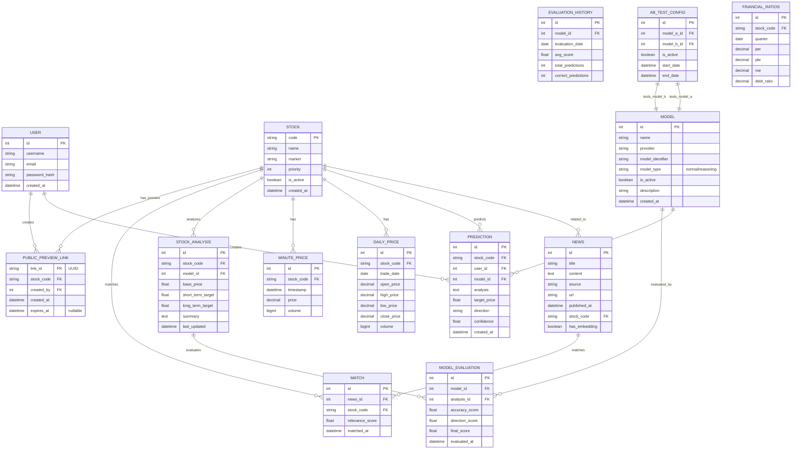
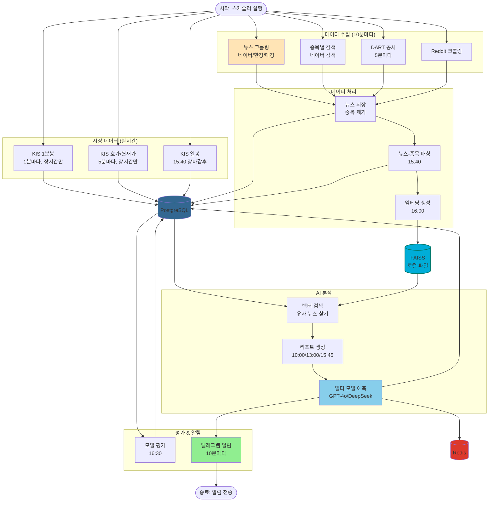

# 데이터 아키텍처

## 개요

백엔드 시스템은 세 가지 주요 데이터 저장소를 사용합니다:
- **PostgreSQL**: 관계형 데이터 (종목, 뉴스, 예측, 사용자 등)
- **FAISS**: 벡터 임베딩 (뉴스 기사 유사도 검색, 로컬 파일 기반)
- **Redis**: 캐싱 (예측 결과, 핫 메트릭)

## 관계형 데이터 (PostgreSQL)

`docs/data-models-backend.md`에 문서화된 엔티티들:
- **사용자**: `user` (인증 정보)
- **종목**: `stock` (종목 정보, 우선순위)
- **뉴스**: `news` (크롤링된 뉴스 기사)
- **예측**: `prediction`, `stock_analysis` (AI 예측 결과)
- **평가**: `model_evaluation`, `evaluation_history` (모델 성능 추적)
- **시장 데이터**: `daily_price`, `minute_price`, `index_daily_price`, `overtime_price` (KIS API)
- **재무 데이터**: `financial_ratios`, `product_info` (기업 재무 정보)
- **A/B 테스트**: `ab_test_config`, `model` (멀티 모델 실험, normal/reasoning 타입 지원)
- **매칭**: `match` (뉴스-주가 연결)
- **공개 프리뷰**: `public_preview_links` (블로그/SNS 홍보용 공개 링크)

## 벡터 임베딩 (FAISS)

- `backend/llm/vector_search.py`를 통해 FAISS 인덱스 관리
- 뉴스 기사 임베딩 저장 및 유사도 검색
- **저장 위치**: `data/faiss_index/` (로컬 파일)
- **임베딩 모델**: KoSimCSE (BM-K/KoSimCSE-roberta) - 한국어 특화
- **마이그레이션 완료**: 2025-11-22, Milvus → FAISS (7,040개 벡터)

## 캐싱 (Redis)

- 핫 메트릭 캐싱
- 예측 결과 캐시 (`backend/llm/prediction_cache.py`)

## 데이터베이스 ERD

## 데이터 플로우 다이어그램

전체 데이터 수집부터 예측, 평가까지의 흐름:

## 관련 문서

- [데이터 모델 상세](../../data/models-backend.md) - 전체 데이터 모델 명세
- [API 설계](./api-design.md) - 데이터 접근 API
- [프로세스 흐름](./processes.md) - 데이터 처리 프로세스
