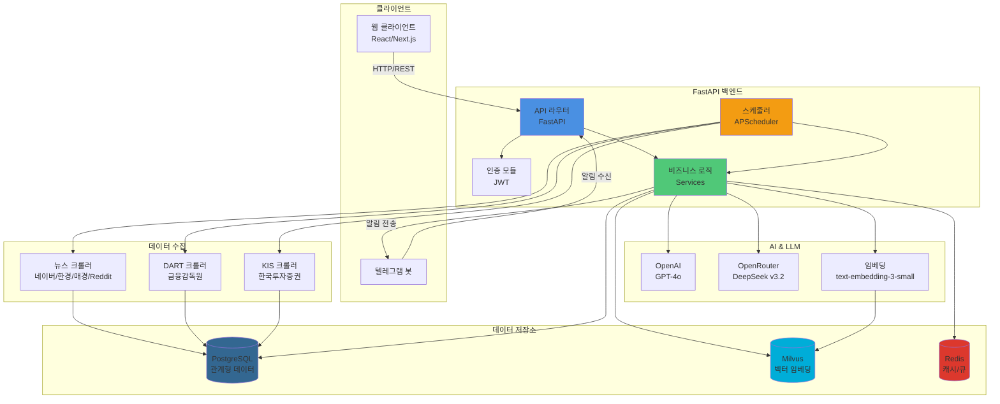

# 백엔드 개요 및 시스템 아키텍처

## 개요

AI 기반 주식 인사이트를 제공하는 FastAPI 기반 API 및 스케줄러 서비스입니다. PostgreSQL로 관계형 데이터를 관리하고, Milvus로 임베딩을 저장하며, Redis로 캐싱을 처리하고, APScheduler로 비동기 작업을 스케줄링합니다.

## 기술 스택

### 핵심 프레임워크
- **Python 3.11**: 프로그래밍 언어
- **FastAPI 0.104.1**: 웹 API 프레임워크
- **Uvicorn 0.24.0**: ASGI 서버

### 데이터베이스 & 스토리지
- **PostgreSQL**: 주 데이터베이스 (SQLAlchemy 2.0.23 ORM)
- **Milvus 2.3.4**: 벡터 임베딩 저장소
- **Redis 5.0.1**: 캐싱 및 작업 큐

### 스케줄링 & 비동기
- **APScheduler 3.10.4**: 백그라운드 작업 스케줄러 (실제 사용)
- ~~Celery~~ (requirements.txt에 있지만 사용하지 않음)

### AI & LLM
- **OpenAI 2.7.2**: GPT-4o (예측), text-embedding-3-small (임베딩)
- **OpenRouter**: DeepSeek v3.2 (대체 LLM 제공자)
- **A/B Testing**: 멀티 모델 성능 비교

### 데이터 수집
- **BeautifulSoup4 4.12.2**: HTML 파싱
- **Requests 2.31.0**: HTTP 클라이언트
- **PRAW 7.8.1**: Reddit API 클라이언트
- **KIS OpenAPI**: 한국투자증권 실시간 시장 데이터

### 인증 & 보안
- **python-jose 3.3.0**: JWT 토큰 관리
- **passlib 1.7.4 + bcrypt 3.2.2**: 비밀번호 해싱

## 아키텍처 패턴

**서비스 지향 아키텍처 (SOA)**

```
FastAPI App
├── API Routers (/backend/api/)
│   ├── 공통 의존성 (config.py)
│   └── 서비스/리포지토리 레이어 호출
├── Background Scheduler (APScheduler)
│   ├── 크롤러 작업 (뉴스, 주가)
│   ├── 예측 배치 작업
│   └── 평가 작업
└── 비동기 작업 큐 (선택적)
```

### 시스템 아키텍처 다이어그램



## 관련 문서

- [데이터 아키텍처](./data-architecture.md) - 데이터베이스 스키마 및 데이터 플로우
- [API 설계](./api-design.md) - REST API 엔드포인트 설계
- [프로세스 흐름](./processes.md) - 주요 프로세스 시퀀스 다이어그램
- [컴포넌트 구조](./components.md) - 컴포넌트 및 소스 트리 분석
- [개발 가이드](./development.md) - 개발 환경 설정 및 테스트
- [배포 가이드](./deployment.md) - 프로덕션 배포 설정
- [최적화 & 보안](./optimization.md) - 성능 최적화 및 보안 고려사항
