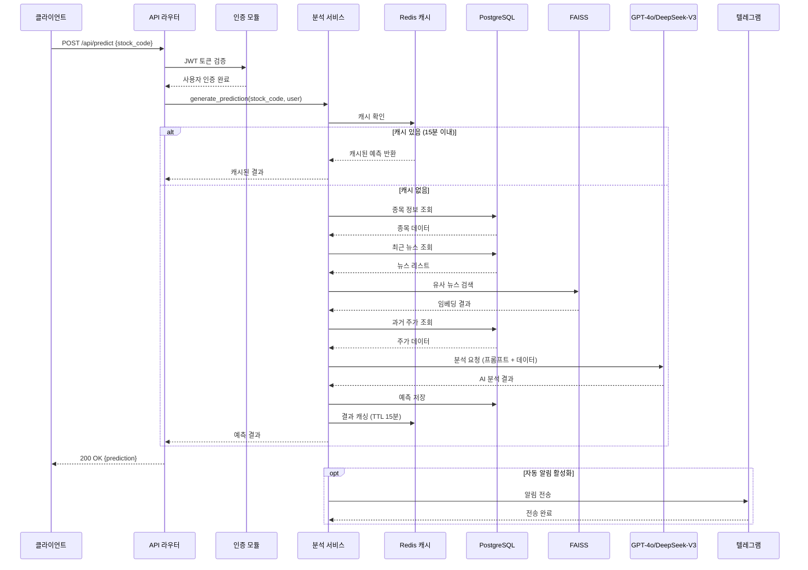
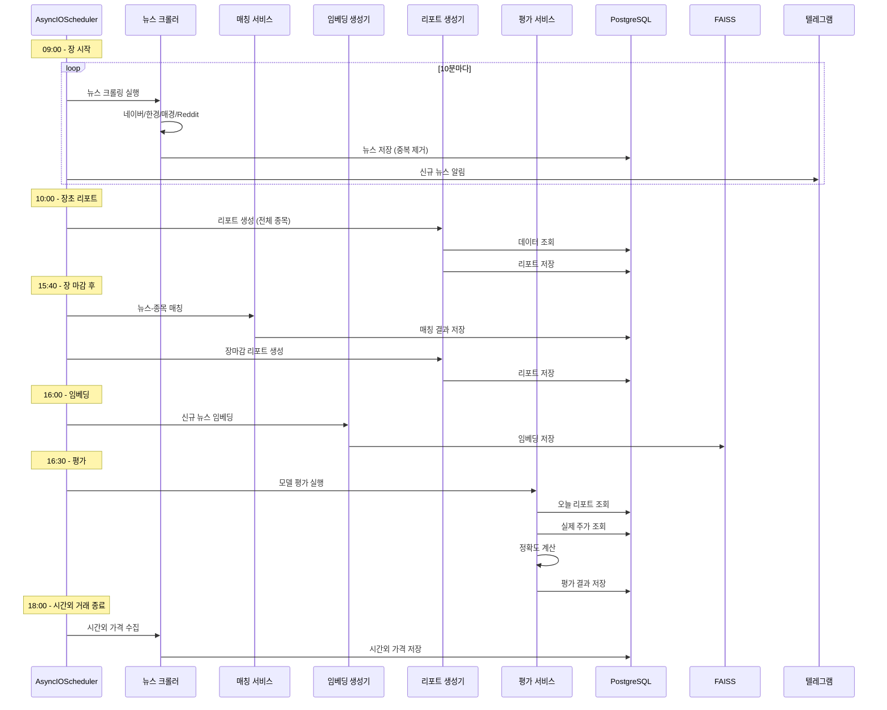

# 주요 프로세스 흐름

## 예측 생성 프로세스

사용자가 종목 예측을 요청할 때의 전체 흐름:

## 스케줄러 작업 흐름

백그라운드 스케줄러의 일일 작업 프로세스:

## 스케줄러 작업 목록

`backend/scheduler/crawler_scheduler.py` - AsyncIOScheduler 기반 크롤링 스케줄러:

### 데이터 수집 (CronTrigger - 0,10,20,30,40,50분)
- **뉴스 크롤링**: 네이버, 한국경제, 매일경제, Reddit (10분 간격)
- **종목별 뉴스 검색**: 네이버 검색 API (10분 간격)
- **DART 공시**: 5분 간격
- **자동 알림**: 10분 간격 (predicted_at 기준 필터링)

### AI 분석 (CronTrigger - 5,15,25,35,45,55분)
- **투자 리포트 생성**: 10:05, 13:05, 15:45 (병렬 처리, 80s → 30s)
- **뉴스 임베딩**: 매일 16:05 (KoSimCSE 로컬 모델)

### 시장 데이터 (장 시간 기반)
- **KIS 일봉 수집**: 매일 15:40
- **KIS 1분봉 수집**: ~~1분 간격~~ → **비활성화** (19,500 API 호출 절감)
- **KIS 시장 데이터**: 5분 간격 (호가, 현재가)
- **시간외 거래 가격**: 매일 18:00

### 평가 및 매칭 (종가 후)
- **뉴스-주가 매칭**: 매일 15:40
- **모델 평가 생성**: 매일 16:30

### 주간 배치 작업
- **투자자별 매매동향**: 매일 16:00
- **업종/지수 일자별**: 매일 18:00
- **상품정보**: 매주 일요일 01:00
- **재무비율**: 매주 일요일 02:00

**주요 변경사항 (2025-11-24)**:
- BackgroundScheduler → AsyncIOScheduler (Segmentation Fault 해결)
- IntervalTrigger → CronTrigger (뉴스 수집과 AI 분석 분리)
- predicted_at 필드 활용 (알림 전송 중복 방지)
- 1분봉 수집 비활성화 (API 비용 절감)

## 관련 문서

- [데이터 플로우](./data-architecture.md#데이터-플로우-다이어그램) - 데이터 처리 흐름
- [컴포넌트](./components.md) - 스케줄러 및 크롤러 구조
- [개발 가이드](./development.md) - 스케줄러 테스트 방법
