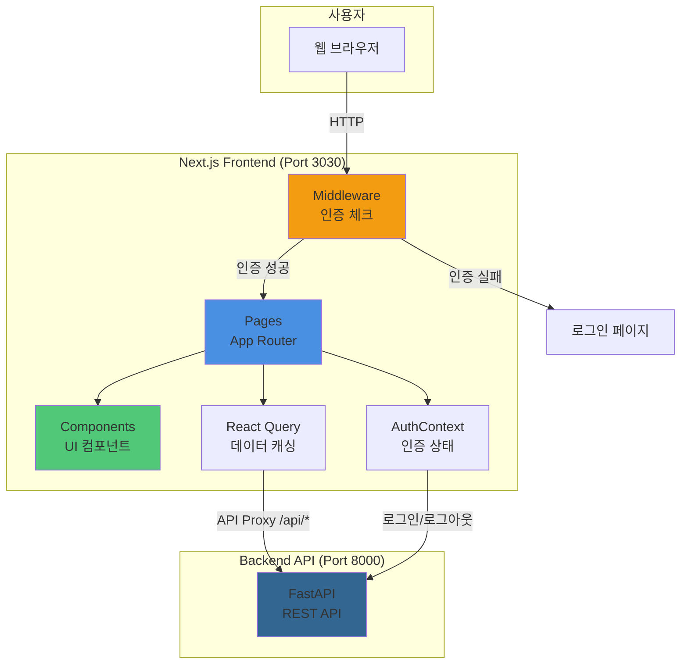

# 프론트엔드 개요 및 시스템 아키텍처

## 개요

Next.js 15 App Router 기반의 투자 인사이트 대시보드입니다. FastAPI 백엔드와 REST API로 통신하며, React Query로 데이터 캐싱, AuthContext로 세션 관리, Tailwind CSS로 UI를 구현합니다.

## 기술 스택

### 핵심 프레임워크
- **Next.js 15.1.4**: React 기반 풀스택 프레임워크
- **React 19.0.0**: UI 라이브러리
- **TypeScript 5**: 타입 안전성

### UI & 스타일링
- **Tailwind CSS 3.4.1**: 유틸리티 기반 CSS 프레임워크
- **lucide-react 0.468.0**: 아이콘 라이브러리
- **class-variance-authority 0.7.1**: 컴포넌트 variant 관리
- **clsx 2.1.1 + tailwind-merge 2.5.0**: 클래스 이름 병합

### 데이터 페칭 & 상태 관리
- **@tanstack/react-query 5.61.5**: 서버 상태 관리 및 캐싱
- **AuthContext**: 클라이언트 인증 상태 관리 (Context API)

### 차트 & 시각화
- **Recharts 2.15.0**: React 차트 라이브러리

### 유틸리티
- **date-fns 4.1.0**: 날짜 포맷팅
- **react-hot-toast 2.6.0**: 토스트 알림

### 개발 도구
- **ESLint 9 + eslint-config-next**: 코드 린팅
- **Node.js >=20.0.0, npm >=10.0.0**: 런타임 요구사항

## 아키텍처 패턴

**App Router 기반 하이브리드 SSR/CSR**

```
Next.js App
├── App Router (/app)
│   ├── layout.tsx (루트 레이아웃)
│   ├── page.tsx (메인 대시보드)
│   ├── /stocks (종목 페이지)
│   ├── /predictions (예측 페이지)
│   ├── /admin (관리자 페이지)
│   └── ... (기타 페이지)
├── Middleware (middleware.ts)
│   └── 인증 체크 및 권한 관리
├── Contexts
│   └── AuthContext (인증 상태)
└── Components
    ├── 공통 컴포넌트
    └── 페이지별 컴포넌트
```

### 시스템 아키텍처 다이어그램



## 프로젝트 구조

```
frontend/
├── app/                      # Next.js App Router
│   ├── layout.tsx            # 루트 레이아웃
│   ├── page.tsx              # 메인 대시보드
│   ├── globals.css           # 전역 스타일
│   ├── icon.svg              # 앱 아이콘
│   ├── components/           # 공통 컴포넌트
│   ├── contexts/             # React Context
│   ├── login/                # 로그인 페이지
│   ├── stocks/               # 종목 페이지
│   ├── predictions/          # 예측 페이지
│   ├── models/               # 모델 관리
│   ├── ab-test/              # A/B 테스트
│   ├── ab-config/            # A/B 설정
│   ├── admin/                # 관리자 페이지
│   │   ├── dashboard/
│   │   ├── evaluations/
│   │   ├── stocks/
│   │   ├── users/
│   │   └── performance/
│   ├── preview/              # 블로그 캡처용 프리뷰
│   └── api/                  # API 라우트 핸들러
├── middleware.ts             # Next.js 미들웨어
├── next.config.ts            # Next.js 설정
├── tailwind.config.ts        # Tailwind 설정
├── tsconfig.json             # TypeScript 설정
└── package.json              # 프로젝트 메타데이터
```

## API 프록시 설정

`next.config.ts`에서 `/api/*` 요청을 백엔드 FastAPI로 프록시:

```typescript
async rewrites() {
  return [
    {
      source: '/api/:path*',
      destination: 'http://127.0.0.1:8000/:path*',
    },
  ];
}
```

이를 통해 프론트엔드에서 `/api/stocks`로 요청하면 자동으로 `http://127.0.0.1:8000/stocks`로 프록시됩니다.

## 인증 구조

### 세션 기반 인증
- **세션 쿠키**: `azak_session` (24시간 유효)
- **Middleware**: 모든 요청에서 세션 쿠키 확인
- **AuthContext**: 클라이언트 인증 상태 관리

### 인증 흐름
1. 사용자가 로그인 (`/api/auth/login`)
2. 백엔드에서 JWT 토큰 생성 및 세션 쿠키 설정
3. AuthContext에 사용자 정보 저장
4. Middleware가 모든 페이지 접근 시 세션 쿠키 확인
5. 세션이 없으면 `/login`으로 리다이렉트

## 관련 문서

- [라우팅 & 페이지](./routing-pages.md) - 페이지 구조 및 라우팅
- [컴포넌트 구조](./components.md) - UI 컴포넌트 구조
- [상태 관리](./state-management.md) - AuthContext, React Query
- [개발 가이드](./development.md) - 개발 환경 설정
- [배포 가이드](./deployment.md) - 프로덕션 배포
