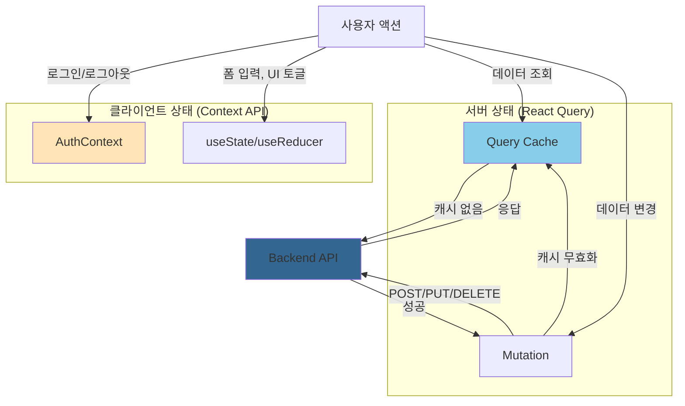

# 상태 관리

## 상태 관리 개요

프론트엔드는 두 가지 주요 상태 관리 방식을 사용합니다:
- **AuthContext**: 클라이언트 인증 상태 (Context API)
- **React Query**: 서버 데이터 페칭 및 캐싱

## AuthContext (인증 상태)

### 개요

`app/contexts/AuthContext.tsx`에서 정의된 전역 인증 상태 관리 Context입니다.

### 인터페이스

```typescript
interface User {
  id: number;
  email: string;
  nickname: string;
  role: "user" | "admin";
  is_active: boolean;
}

interface AuthContextType {
  user: User | null;
  loading: boolean;
  login: (email: string, password: string) => Promise<void>;
  logout: () => Promise<void>;
  checkAuth: () => Promise<void>;
  isAuthenticated: boolean;
  isAdmin: boolean;
}
```

### 주요 기능

#### 1. 로그인 (`login`)

```typescript
const login = async (email: string, password: string) => {
  const response = await fetch("/api/auth/login", {
    method: "POST",
    headers: { "Content-Type": "application/json" },
    credentials: "include", // 쿠키 포함
    body: JSON.stringify({ email, password }),
  });

  if (!response.ok) {
    throw new Error("로그인 실패");
  }

  const data = await response.json();
  setUser(data.user);
};
```

- **POST** `/api/auth/login`
- 성공 시 세션 쿠키 (`azak_session`) 설정
- `user` 상태 업데이트

#### 2. 로그아웃 (`logout`)

```typescript
const logout = async () => {
  await fetch("/api/auth/logout", {
    method: "POST",
    credentials: "include",
  });

  setUser(null);
};
```

- **POST** `/api/auth/logout`
- 세션 쿠키 제거
- `user` 상태 초기화

#### 3. 인증 확인 (`checkAuth`)

```typescript
const checkAuth = async () => {
  const response = await fetch("/api/auth/check", {
    credentials: "include",
  });

  if (response.ok) {
    const data = await response.json();
    if (data.authenticated) {
      setUser(data.user);
    }
  }
};
```

- **GET** `/api/auth/check`
- 컴포넌트 마운트 시 자동 실행
- 세션 유효성 검증

### 사용 예시

```tsx
import { useAuth } from "@/app/contexts/AuthContext";

function MyComponent() {
  const { user, isAuthenticated, isAdmin, login, logout } = useAuth();

  if (!isAuthenticated) {
    return <div>로그인이 필요합니다.</div>;
  }

  return (
    <div>
      <h1>안녕하세요, {user.nickname}님</h1>
      {isAdmin && <AdminPanel />}
      <button onClick={logout}>로그아웃</button>
    </div>
  );
}
```

## React Query (서버 상태)

### 개요

`@tanstack/react-query`를 사용하여 서버 데이터 페칭, 캐싱, 동기화를 관리합니다.

### 설정

`app/layout.tsx`나 별도의 Provider에서 QueryClient를 설정합니다:

```tsx
import { QueryClient, QueryClientProvider } from "@tanstack/react-query";

const queryClient = new QueryClient({
  defaultOptions: {
    queries: {
      staleTime: 1000 * 60 * 5, // 5분
      cacheTime: 1000 * 60 * 30, // 30분
      refetchOnWindowFocus: false,
    },
  },
});

export default function RootLayout({ children }) {
  return (
    <QueryClientProvider client={queryClient}>
      {children}
    </QueryClientProvider>
  );
}
```

### 주요 훅

#### 1. `useQuery` - 데이터 조회

```tsx
import { useQuery } from "@tanstack/react-query";

function StockList() {
  const { data, isLoading, error } = useQuery({
    queryKey: ["stocks"],
    queryFn: async () => {
      const res = await fetch("/api/stocks");
      return res.json();
    },
  });

  if (isLoading) return <div>로딩 중...</div>;
  if (error) return <div>에러: {error.message}</div>;

  return (
    <ul>
      {data.map(stock => (
        <li key={stock.code}>{stock.name}</li>
      ))}
    </ul>
  );
}
```

#### 2. `useMutation` - 데이터 변경

```tsx
import { useMutation, useQueryClient } from "@tanstack/react-query";

function CreatePrediction() {
  const queryClient = useQueryClient();

  const mutation = useMutation({
    mutationFn: async (stockCode: string) => {
      const res = await fetch("/api/predict", {
        method: "POST",
        body: JSON.stringify({ stock_code: stockCode }),
      });
      return res.json();
    },
    onSuccess: () => {
      // 예측 목록 캐시 무효화
      queryClient.invalidateQueries({ queryKey: ["predictions"] });
    },
  });

  return (
    <button onClick={() => mutation.mutate("005930")}>
      예측 생성
    </button>
  );
}
```

### 캐싱 전략

#### Query Key 설계

```tsx
// 전체 종목 목록
["stocks"]

// 개별 종목 상세
["stocks", stockCode]

// 종목별 예측
["predictions", stockCode]

// 모델 평가
["evaluations", modelId]

// 필터링된 데이터
["predictions", { stockCode, date: "2025-01-01" }]
```

#### 캐시 무효화 (Invalidation)

```tsx
// 특정 쿼리만 무효화
queryClient.invalidateQueries({ queryKey: ["stocks", "005930"] });

// 접두사로 무효화 (모든 predictions 캐시)
queryClient.invalidateQueries({ queryKey: ["predictions"] });

// 전체 캐시 무효화
queryClient.invalidateQueries();
```

#### 낙관적 업데이트 (Optimistic Update)

```tsx
const mutation = useMutation({
  mutationFn: updateStock,
  onMutate: async (newStock) => {
    // 이전 데이터 백업
    await queryClient.cancelQueries({ queryKey: ["stocks"] });
    const previousStocks = queryClient.getQueryData(["stocks"]);

    // 낙관적으로 캐시 업데이트
    queryClient.setQueryData(["stocks"], (old) => {
      return old.map(s => s.code === newStock.code ? newStock : s);
    });

    return { previousStocks };
  },
  onError: (err, newStock, context) => {
    // 에러 시 롤백
    queryClient.setQueryData(["stocks"], context.previousStocks);
  },
  onSettled: () => {
    // 완료 후 리페치
    queryClient.invalidateQueries({ queryKey: ["stocks"] });
  },
});
```

### 페이지네이션

```tsx
import { useQuery } from "@tanstack/react-query";
import { useState } from "react";

function PaginatedNews() {
  const [page, setPage] = useState(1);

  const { data, isLoading } = useQuery({
    queryKey: ["news", page],
    queryFn: () => fetchNews(page),
    keepPreviousData: true, // 페이지 전환 시 이전 데이터 유지
  });

  return (
    <>
      <NewsList news={data?.items} />
      <button onClick={() => setPage(p => p - 1)} disabled={page === 1}>
        이전
      </button>
      <button onClick={() => setPage(p => p + 1)} disabled={!data?.has_next}>
        다음
      </button>
    </>
  );
}
```

### 무한 스크롤 (Infinite Query)

```tsx
import { useInfiniteQuery } from "@tanstack/react-query";

function InfiniteNewsFeed() {
  const {
    data,
    fetchNextPage,
    hasNextPage,
    isFetchingNextPage,
  } = useInfiniteQuery({
    queryKey: ["news", "infinite"],
    queryFn: ({ pageParam = 1 }) => fetchNews(pageParam),
    getNextPageParam: (lastPage) => lastPage.next_page,
  });

  return (
    <>
      {data?.pages.map(page => (
        page.items.map(news => <NewsCard key={news.id} news={news} />)
      ))}
      {hasNextPage && (
        <button onClick={fetchNextPage} disabled={isFetchingNextPage}>
          {isFetchingNextPage ? "로딩 중..." : "더 보기"}
        </button>
      )}
    </>
  );
}
```

## 로컬 상태 (useState, useReducer)

### 언제 사용하는가?

- 폼 입력 상태
- UI 토글 (모달, 드롭다운)
- 일시적인 상태

### 예시

```tsx
import { useState } from "react";

function SearchForm() {
  const [query, setQuery] = useState("");
  const [isOpen, setIsOpen] = useState(false);

  return (
    <>
      <input
        value={query}
        onChange={(e) => setQuery(e.target.value)}
      />
      <button onClick={() => setIsOpen(true)}>필터 열기</button>
      {isOpen && <FilterModal onClose={() => setIsOpen(false)} />}
    </>
  );
}
```

## 상태 관리 흐름 다이어그램



## 관련 문서

- [API 계약](../../api/contracts-frontend.md) - API 엔드포인트
- [컴포넌트](./components.md) - 컴포넌트에서 상태 사용
- [개요](./overview.md) - 전체 아키텍처
