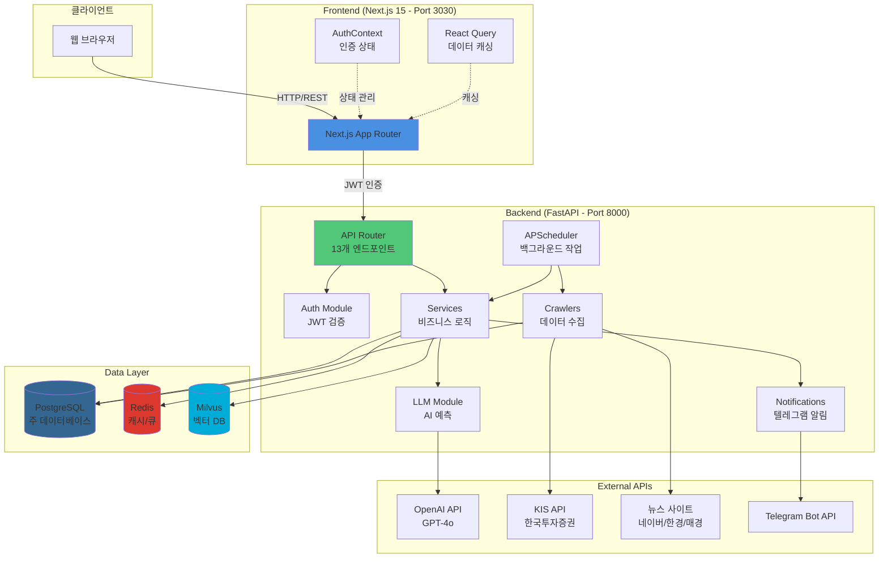
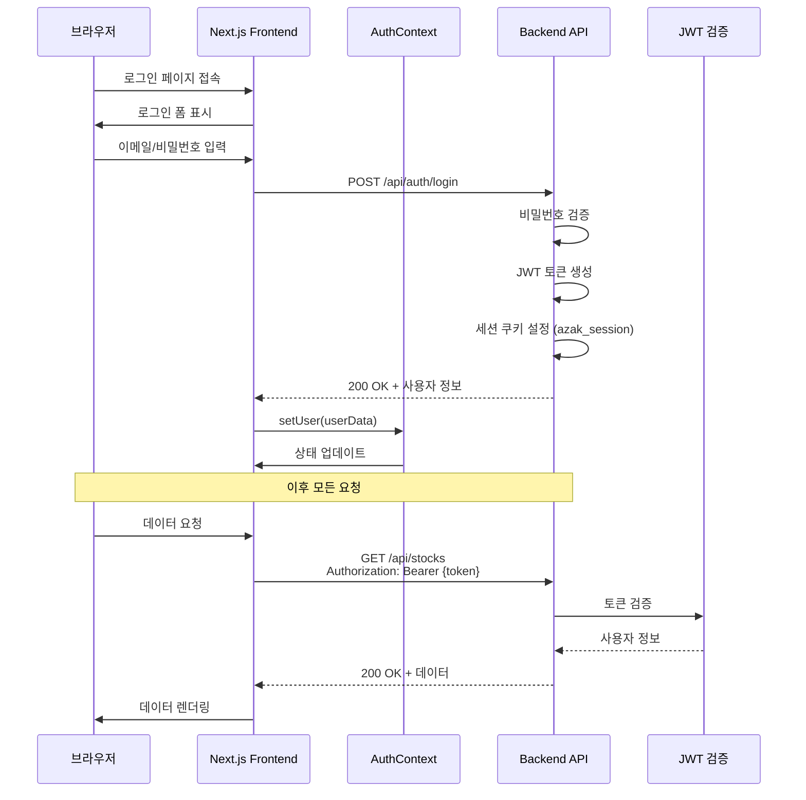
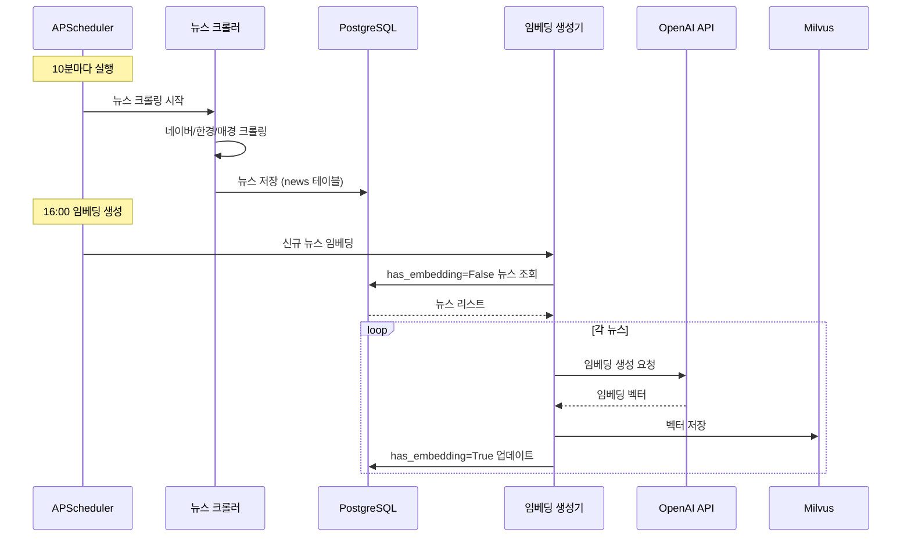
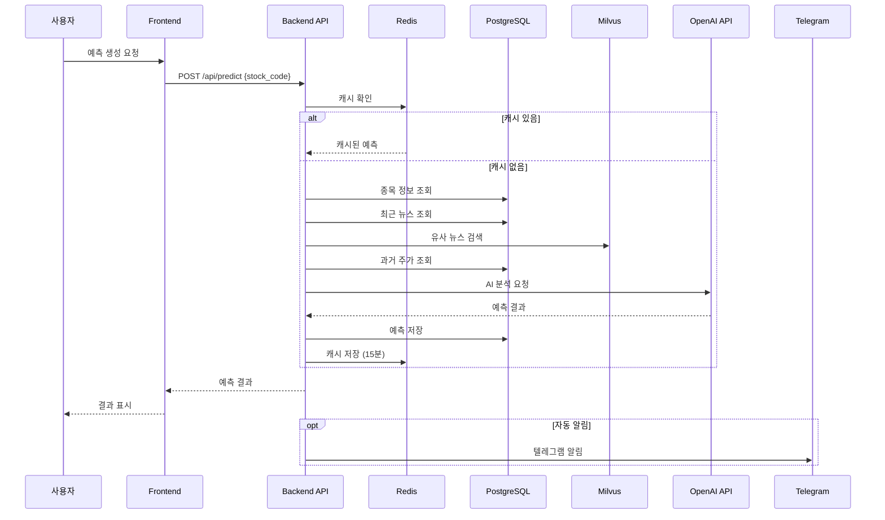
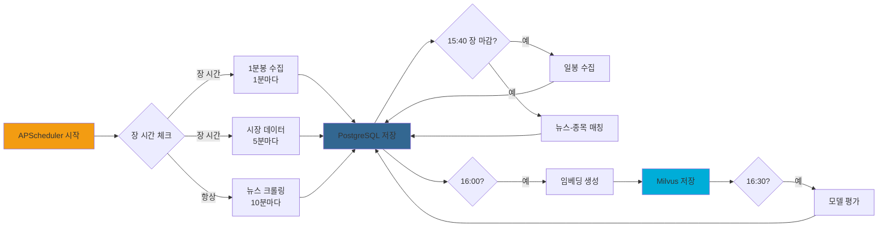

# 통합 아키텍처

## 개요

Azak 프로젝트는 Frontend (Next.js), Backend (FastAPI), Infrastructure (Docker Compose) 세 가지 주요 파트로 구성되며, 각 파트는 REST API, 데이터베이스 연결, 메시지 큐 등 다양한 방식으로 통합됩니다.

## 전체 통합 아키텍처 다이어그램



## 서비스 간 통합 매트릭스

| From | To | 프로토콜 | 인증 방식 | 주요 데이터 |
|------|-----|----------|-----------|-------------|
| Frontend | Backend | REST/HTTP | JWT (Authorization 헤더) | 종목, 예측, 뉴스, 사용자 |
| Backend | PostgreSQL | TCP (SQLAlchemy ORM) | 사용자명/비밀번호 | 모든 관계형 데이터 |
| Backend | Redis | TCP (redis-py) | 비밀번호 (선택) | 캐시, 작업 큐 |
| Backend | Milvus | gRPC | 없음 | 뉴스 임베딩 벡터 |
| Backend | OpenAI | HTTPS | API Key | 예측 요청/응답, 임베딩 |
| Backend | KIS API | HTTPS | APP Key/Secret | 주가, 재무 데이터 |
| Backend | Telegram | HTTPS | Bot Token | 알림 메시지 |
| Crawlers | 뉴스 사이트 | HTTPS | 없음 | HTML (파싱) |

## Frontend ↔ Backend 통합

### API 엔드포인트 통합

Frontend에서 Backend로 요청하는 주요 API:

| 엔드포인트 | 메서드 | 설명 | Frontend 페이지 |
|------------|--------|------|------------------|
| `/api/auth/login` | POST | 로그인 | `/login` |
| `/api/auth/logout` | POST | 로그아웃 | 전체 |
| `/api/auth/check` | GET | 세션 확인 | 전체 (AuthContext) |
| `/api/dashboard/stats` | GET | 대시보드 통계 | `/` |
| `/api/stocks` | GET | 종목 목록 | `/stocks` |
| `/api/stocks/{code}` | GET | 종목 상세 | `/stocks/[code]` |
| `/api/predict` | POST | 예측 생성 | `/stocks/[code]` |
| `/api/predictions` | GET | 예측 목록 | `/predictions` |
| `/api/news` | GET | 뉴스 목록 | `/` |
| `/api/models` | GET | 모델 목록 | `/models` |
| `/api/ab-test/config` | GET/POST | A/B 테스트 설정 | `/ab-config` |
| `/api/evaluations` | GET | 모델 평가 | `/admin/evaluations` |
| `/api/users` | GET/POST/PUT | 사용자 관리 | `/admin/users` |

### 인증 흐름



### React Query 통합

Frontend는 React Query를 사용하여 서버 상태를 관리합니다:

```typescript
// 예시: 종목 목록 조회
const { data, isLoading, error } = useQuery({
  queryKey: ['stocks'],
  queryFn: async () => {
    const res = await fetch('/api/stocks', {
      headers: {
        'Authorization': `Bearer ${token}`,
      },
    });
    return res.json();
  },
  staleTime: 1000 * 60 * 5, // 5분
});
```

### API 프록시 설정

`next.config.ts`:
```typescript
async rewrites() {
  return [
    {
      source: '/api/:path*',
      destination: 'http://127.0.0.1:8000/:path*',
    },
  ];
}
```

Frontend의 `/api/*` 요청은 자동으로 Backend `http://127.0.0.1:8000/*`로 프록시됩니다.

## Backend ↔ 데이터 레이어 통합

### PostgreSQL 통합

**연결 방식**: SQLAlchemy 2.0 ORM

**연결 풀 설정** (`backend/db/session.py`):
```python
engine = create_engine(
    settings.DATABASE_URL,
    pool_size=30,
    max_overflow=50,
    pool_recycle=3600,
    pool_pre_ping=True,
)
```

**주요 모델**:
- `backend/db/models/user.py`: 사용자
- `backend/db/models/stock.py`: 종목
- `backend/db/models/news.py`: 뉴스
- `backend/db/models/prediction.py`: 예측
- `backend/db/models/model.py`: AI 모델

**트랜잭션 관리**:
```python
from backend.db.session import get_db

def create_prediction(db: Session, data: dict):
    prediction = Prediction(**data)
    db.add(prediction)
    db.commit()
    db.refresh(prediction)
    return prediction
```

### Redis 통합

**연결 방식**: `redis-py` 라이브러리

**사용 목적**:
1. **캐싱**: 예측 결과, 메트릭
2. **작업 큐**: APScheduler 락
3. **세션 저장**: (선택사항)

**예시** (`backend/llm/prediction_cache.py`):
```python
import redis

redis_client = redis.Redis(
    host=settings.REDIS_HOST,
    port=settings.REDIS_PORT,
    decode_responses=True,
)

# 캐시 저장
redis_client.setex(
    f"prediction:{stock_code}",
    900,  # 15분 TTL
    json.dumps(prediction_data),
)

# 캐시 조회
cached = redis_client.get(f"prediction:{stock_code}")
```

### Milvus 통합

**연결 방식**: `pymilvus` 라이브러리 (gRPC)

**사용 목적**: 뉴스 기사 임베딩 저장 및 유사도 검색

**초기화** (`backend/db/milvus_client.py`):
```python
from pymilvus import connections, Collection

connections.connect(
    alias="default",
    host=settings.MILVUS_HOST,
    port=settings.MILVUS_PORT,
)

collection = Collection("news_embeddings")
```

**벡터 삽입**:
```python
# 임베딩 생성
embedding = openai.Embedding.create(
    input=news_text,
    model="text-embedding-3-small",
)

# Milvus에 저장
collection.insert([
    [news_id],
    [embedding["data"][0]["embedding"]],
])
```

**유사도 검색**:
```python
results = collection.search(
    data=[query_embedding],
    anns_field="embedding",
    param={"metric_type": "L2", "params": {"nprobe": 10}},
    limit=10,
)
```

## 외부 API 통합

### OpenAI API

**사용 목적**:
1. **GPT-4o**: 주식 예측 생성
2. **text-embedding-3-small**: 뉴스 임베딩

**통합** (`backend/llm/multi_model_predictor.py`):
```python
import openai

openai.api_key = settings.OPENAI_API_KEY

response = openai.ChatCompletion.create(
    model="gpt-4o",
    messages=[
        {"role": "system", "content": "당신은 주식 분석 전문가입니다."},
        {"role": "user", "content": prompt},
    ],
    temperature=0.7,
)
```

### KIS API (한국투자증권)

**사용 목적**: 실시간 시장 데이터 (주가, 호가, 재무)

**인증** (`backend/crawlers/kis_client.py`):
```python
import requests

# 토큰 발급
response = requests.post(
    "https://openapi.koreainvestment.com:9443/oauth2/tokenP",
    json={
        "grant_type": "client_credentials",
        "appkey": settings.KIS_APP_KEY,
        "appsecret": settings.KIS_APP_SECRET,
    },
)
access_token = response.json()["access_token"]
```

**API 호출**:
```python
# 현재가 조회
headers = {
    "Authorization": f"Bearer {access_token}",
    "appkey": settings.KIS_APP_KEY,
    "appsecret": settings.KIS_APP_SECRET,
}

response = requests.get(
    "https://openapi.koreainvestment.com:9443/uapi/domestic-stock/v1/quotations/inquire-price",
    headers=headers,
    params={"FID_COND_MRKT_DIV_CODE": "J", "FID_INPUT_ISCD": stock_code},
)
```

### 뉴스 크롤링

**사용 사이트**:
- 네이버 뉴스
- 한국경제
- 매일경제
- Reddit (r/stocks 등)

**통합** (`backend/crawlers/naver_crawler.py`):
```python
from bs4 import BeautifulSoup
import requests

response = requests.get(news_url)
soup = BeautifulSoup(response.text, 'html.parser')

title = soup.select_one('.news_title').text
content = soup.select_one('.news_body').text
```

### Telegram Bot API

**사용 목적**: 예측 결과 및 뉴스 알림

**통합** (`backend/notifications/telegram.py`):
```python
import telegram

bot = telegram.Bot(token=settings.TELEGRAM_BOT_TOKEN)

bot.send_message(
    chat_id=settings.TELEGRAM_CHAT_ID,
    text=f"📊 {stock_name} 예측 완료\n방향: {direction}\n신뢰도: {confidence}%",
)
```

## 데이터 플로우

### 뉴스 수집 → 임베딩 → 저장



### 예측 생성 플로우



### 스케줄러 작업 플로우



## 에러 핸들링

### Frontend 에러 처리

```typescript
// React Query 에러 핸들링
const { data, error } = useQuery({
  queryKey: ['stocks'],
  queryFn: fetchStocks,
  retry: 3,
  onError: (error) => {
    toast.error(`데이터 조회 실패: ${error.message}`);
  },
});

// API 호출 에러
try {
  const response = await fetch('/api/predict', {
    method: 'POST',
    body: JSON.stringify({ stock_code }),
  });

  if (!response.ok) {
    throw new Error(`HTTP ${response.status}`);
  }
} catch (error) {
  console.error('예측 생성 실패:', error);
  toast.error('예측 생성에 실패했습니다.');
}
```

### Backend 에러 처리

```python
from fastapi import HTTPException

@app.get("/api/stocks/{stock_code}")
async def get_stock(stock_code: str, db: Session = Depends(get_db)):
    try:
        stock = db.query(Stock).filter(Stock.code == stock_code).first()
        if not stock:
            raise HTTPException(status_code=404, detail="종목을 찾을 수 없습니다")
        return stock
    except Exception as e:
        logger.error(f"종목 조회 실패: {e}")
        raise HTTPException(status_code=500, detail="서버 오류가 발생했습니다")
```

### 외부 API 에러 처리

```python
import requests
from requests.adapters import HTTPAdapter
from requests.packages.urllib3.util.retry import Retry

# 재시도 전략
retry_strategy = Retry(
    total=3,
    backoff_factor=1,
    status_forcelist=[429, 500, 502, 503, 504],
)

adapter = HTTPAdapter(max_retries=retry_strategy)
session = requests.Session()
session.mount("https://", adapter)

try:
    response = session.get("https://api.example.com/data", timeout=10)
    response.raise_for_status()
except requests.exceptions.RequestException as e:
    logger.error(f"API 호출 실패: {e}")
    # 대체 로직 또는 에러 반환
```

## 모니터링 및 로깅

### 로깅 설정

**Backend** (`backend/main.py`):
```python
import logging

logging.basicConfig(
    level=logging.INFO,
    format='%(asctime)s - %(name)s - %(levelname)s - %(message)s',
    handlers=[
        logging.FileHandler('data/logs/app.log'),
        logging.StreamHandler(),
    ],
)

logger = logging.getLogger(__name__)
```

### 헬스체크 엔드포인트

**Backend** (`backend/api/health.py`):
```python
@router.get("/health")
async def health_check():
    return {
        "status": "healthy",
        "timestamp": datetime.now().isoformat(),
        "services": {
            "postgres": check_postgres(),
            "redis": check_redis(),
            "milvus": check_milvus(),
        },
    }
```

### 모니터링 포인트

| 항목 | 엔드포인트/명령어 | 설명 |
|------|-------------------|------|
| Backend API | `GET /health` | 서비스 상태 |
| PostgreSQL | `docker exec azak-postgres pg_isready` | DB 연결 |
| Redis | `docker exec azak-redis redis-cli ping` | Redis 연결 |
| Milvus | `curl http://localhost:9091/healthz` | Milvus 상태 |
| Docker | `docker stats` | 컨테이너 리소스 |

## 보안 고려사항

### API 인증

- **JWT 토큰**: Authorization 헤더
- **세션 쿠키**: HttpOnly, Secure 설정
- **CORS**: 허용된 도메인만 접근

### 민감 데이터 보호

- **환경 변수**: `.env` 파일 (gitignore)
- **API 키**: 서버 사이드에만 저장
- **비밀번호**: bcrypt 해싱

### Rate Limiting

```python
from slowapi import Limiter
from slowapi.util import get_remote_address

limiter = Limiter(key_func=get_remote_address)

@app.get("/api/predict")
@limiter.limit("10/minute")
async def predict(request: Request):
    # ...
```

## 관련 문서

- [Backend 아키텍처](./backend/index.md) - FastAPI 서비스 상세
- [Frontend 아키텍처](./frontend/index.md) - Next.js 대시보드 상세
- [Infrastructure 아키텍처](./infrastructure.md) - Docker Compose 스택
- [Backend API 계약](../api/contracts-backend.md) - API 명세
- [Frontend API 통합](../api/contracts-frontend.md) - API 사용법

---

**📝 문서 버전:** 2.0.0
**마지막 업데이트:** 2025-11-20
**변경사항**: 실제 구현 검증 및 한글 상세 문서 작성, 다이어그램 추가
